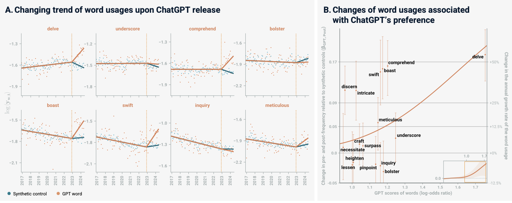

### Take-away from discussion about AI 

**Learning with AI:**

* AI is a great study partner
* Although it has to be integrated well since it introduces the risk of being misinformed and have lower brain engagement
* You can promt the AI to teach you something from the level you want, e.g. beginner or high-school student level 

**Productivity with AI:**

* In a study, experts in bioinformatics thought AI would make their work more efficient, however it showed the opposite!
* The experts lost time to 1) checking and correcting code generated by AI, 2) having better knowledge themselves, 3) AI not understanding the context of their work etc.

**Data Privacy and Legal Concerns:**

* Terms of Service from AI companies are often very invasive in their way of collecting data from you. It's important to consider using AI or not based on what information you want to be shared. See an example below:

[**Account Personal Data**, We collect Personal Data that you provide when you set up an account, such as your date of birth (where applicable), username (where applicable), email address and/or telephone number, and password.

**User Input**, When you use our Services, we may collect your text input, prompt, uploaded files, feedback, chat history, or other content that you provide to our model and Services (“Prompts” or "Inputs"). We generate responses (“Outputs”) based on your Inputs.

**Personal Data When You Contact Us**, When you contact us, we collect the Personal Data you send us, such as proof of identity or age, contact details, feedback or inquiries about your use of the Services or Personal Data about possible violations of our Terms of Service (our “Terms”) or other policies.]{.mark}

* Protection of sensitive biological data is highly important when using AI. A **serious** mistake people can make is using input sequences, tables, or other data into a GPT to find ways to plot data, perform sequence annotations, or similar tasks. Be wary of doing this as the AI will collect your sensitive data!

**Local and open-weight models:**

* It's important to know that when you use a commercial model, any data attached to it will land on someone else’s server.
* **Local models** inhibits your data to leave your computer, some examples of these are: **Ollama** and **LM-studio** -> These are open-weight LLMs
* These can be used offline
* However, your computer might not have the hardware to run these models. A small laptop generally has a weaker version of a local model

**Personal Responsibility:**

* Check every reference that is generated from AI, e.g. always ask where the information comes from in an article

**Global Linguistic Changes:**

* AI changes how humans write, speak and feel about what it generates.
* Our perception is that the younger generation uses AI to write because they are less used to write their own text
* Academic writing sounds AI generated
* Different GPTs have different writing styles depending on where you are in the world

GPT words in YouTube videos from [Yakura et al 2025](https://arxiv.org/pdf/2409.01754)

**AI on the Internet:**

* AI is trained on many different inappropriate datasets, e.g. Reddit -> leading to data pollution
* Today you cannot be sure if something is written by a human or a bot
* Reddit has agreements with Google and OpenAI, aka they get money from having their content used for model training
* The amount of content generated by AI rose from 2-3% in November 2022 to 24% by the end of 2023

**Environmental Impact:**

* Do not ask questions that you coulnd't find yourself
* Do not use "Please" or "Thank you", every added word uses more energy
* Add `-ai` at the end of Google searches to remove automatic AI generated content

**AI and reproducible research:**
* Reproducibility practises used to take a lot of time and money to implement and was intimidating to initiate
* AI has made it easier to intiate reproducibility in research, e.g. it helps with creating a Github repository and appropriate commit messages quickly

### A framework for working with AI
Working well and effectively with AI can be desribed by the four D’s:

* **Delegation**: Deciding whether, when, and how to involve AI at all. Ask the questions *Can I find this information in another way?* and *How much time am I saving by using AI?*

* **Description**: Describing what you want clearly enough to get a useful result. Prompting is everything! Ask the question *Is my promt good enough?*

* **Discernment**: Judging the quality of what comes back rather than accepting it. This is probably the most important part! Ask the question *Do I know enough about the topic to know whether the GPT is lying to me?*

* **Diligence**: Taking responsibility for how you used AI in your work. Be honest about when and how you used AI. Ask the question *What are the consequences of testing the validity of the AI output? Will I potentially lie about my research if I don't validate it?* 
