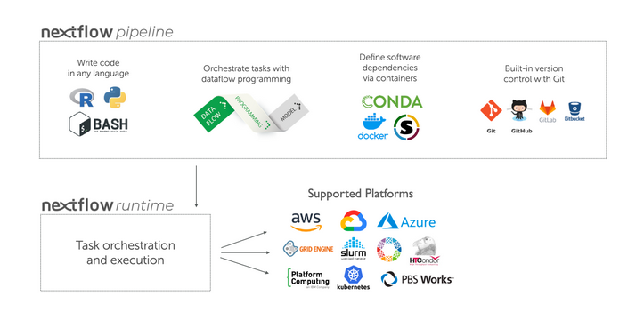

Traditionally, you would have about one script per tool, all of which you deploy by hand, one after the other. Together, this is called a `workflow` or `pipeline`.

Manual deployment of pipelines is not always the most effective path to take in cases of:
* Many steps in your analysis
* Many files needing processing
* Files with different sizes; one takes a minute to run, another takes an hour...

With the goal of automizing pipelines/workflows a software was made: **workflow managers**. What does it do?
* Coordinates the deployment of the scripts in the appropriate sequence
* Monitors the jobs
* Handles the file transfers between scripts
* Gathers the output
* Handles re-execution of failed jobs for you
* Can run containers -> which eliminates software installation and version conflicts

There are two workflow managers that are widely used: **snakemake** and **nextflow**.

### Nextflow pipeline
In practice, a Nextflow workflow is made by joining together different `processes`. Each can be written in any scripting language that can be executed by the Linux platform (Bash, Perl, Ruby, Python, etc.). 

Processes are executed independently and are isolated from each other, they only communicate via `channels`.

In Nextflow there are two kinds of channels: `queue channels` and `value channels`:
* `queue channel` is a non-blocking unidirectional FIFO queue which connects two processes, channel factories, or operators.
* `value channel` also called singleton channel is bound to a single value and can be read an unlimited number of times without consuming its content.

Any `process` can define one or more `channels` as an `input` and `output`.

{width="100%"}

Here is a `process block` that describes the picture above as part of a Nextflow pipeline:

```{.bash}
process PROCESS_NAME{

    input:
      data z
      data y
      data x

    // directives
    container

    script:
      task1
      task2
      task3

    output:
      output x
      output y
      output z
}
```

* `process` defines what command or script is executed
* `executor` determines how that script is run in the target platform.

:::{.callout-note}
If not otherwise specified, processes are executed on the `local` computer. This is useful for: 
* Workflow development
* Testing purposes

**However**, real-world computational workflows a high-performance computing (HPC) or cloud platform is often required.
:::

{width="100%"}