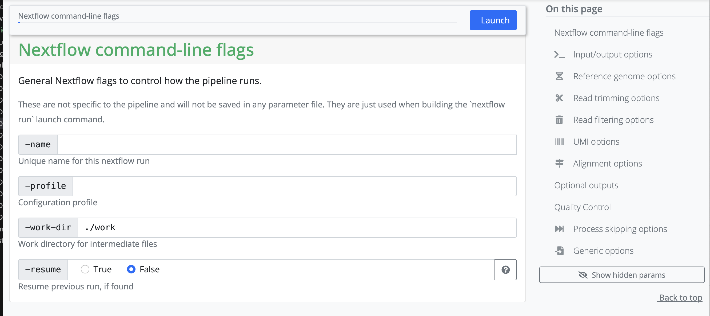
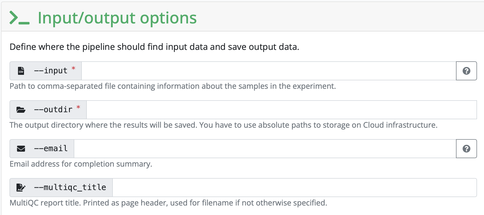
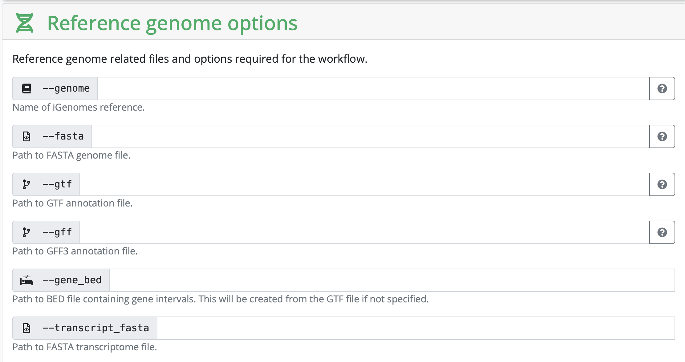
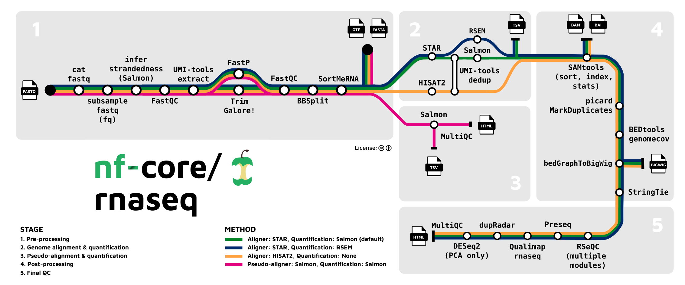

Most bioinformaticians don't do the hard work of making their own pipelines from scratch. Instead, they use some flagship pipelines that have been developed by the [`nf-core`](https://nf-co.re/pipelines/) community! There are **157 pipelines** available.

**Volunteers** develop nextflow pipelines around a variety of bioinformatic data. All `nf-core` pipelines are open source and the source code is available on github.

:::{.callout-note}
Please be aware that `nf-core` pipelines are developed and maintained (or not maintained) by the community. You cannot copy paste the pipelines on your own data, instead you should use it as a tool you need to understand. The responsibility for the end results is still yours, so you need to see if your data is suited for the analysis!
:::

:::{.callout-note}
Mind you, if your data is of bad quality it doesn't matter if the pipeline fits. Please use **QC** on your data before using the pipeline!
:::


## How do I know how to use the Pipelines
The `nf-core` community has developed aids for you to understand their pipelines:

* Training material for all user classes
* Best practices for documentation
* Templates for development
* Good documentation following `nf-core` guidelines
* `nf-core launcher` can be used to check your input, and automatically generate commands and configuration files


## What information is contained in each nf-core section?

Under the `Usage` tab, you will find **extensive information** that describes the pipeline, including input information, the samplesheet.csv.

Under the `Parameters` tab, you will find which parameters can be added to the pipeline and which **parameters are necessary**, e.g `--input` or `--email`

Under the `Output` tab, you will find the expected output produced by the pipeline. This is useful for **output interpretation** of what the pipeline produces.


## How to start running a pipeline from nf-core

### 1. Setup your pixi environment with both `nextflow`and `nf-core` with the following commands:

```{.bash}
pixi init nf_rnaseq_test -c conda-forge -c bioconda #Makes a new project directory with a pixi environment containing conda-forge and bioconda

cd name_nextflow #Enter the project directory

pixi add nextflow nf-core #Adds nextflow and nf-core

screen -S nf_core_training #Opens a screen to apply our run to

pixi run nextflow 
pixi run nf-core #Run both

pixi run nextflow run hello #Test the pipeline called "hello"
```

### 2. Configure your profile
There are two ways to configure your profile:

- **Manually create** a `server.config` file (exchange "server" with the name of the server, e.g. hpc2n)
- Find the server profile you are using in [**nf-core configs**](https://nf-co.re/configs/), then follow the instructions described

A `server.config` file should look something like this:

```{.bash}
# Config profile for HPC2N

params {
  config_profile_description = 'Cluster profile for HPC2N'
  config_profile_contact = 'Lina Andersson'
  config_profile_url = 'https://www.hpc2n.umu.se/'
  project = null #Fill in the project name of our project (can be found in SUPR NAISS), e.g. 'hpc2ncourses2026-016' with single lines
  clusterOptions = null
  max_memory = 128.GB
  max_cpus = 28
  max_time = 168.h
  email = 'lina.karlsen.andersson@gu.se' #Fill in the email of the person who recieves updates on the run
}

singularity {
  enabled = true #Decides that containers can be used in this process
}

process {
  executor = 'slurm' #Informs which executor used for the process
  clusterOptions = { "-A $params.project ${params.clusterOptions ?: ''}" }
}
```

### 3. Link the data to your directory 
In order for `nf-core` and `nextflow` to find your data, you need to add them to the directory which contains all information for the pipeline to run. You can either:
- Add your data into a subdirectory
- Link your data from another directory into the working directory, using this command:

```{.bash}
ln -s absolute_path_to_data/*fastq.gz .
```

:::{.callout-note}
Don't forget the . in the end!
:::


### 4. Use nf-core launcher to build a JSON file
Here comes the hardest part, but fret not it's simple when you resolve all issues once, which I will give notes on! 

In the pipeline chosen from `nf-core` you can use the **launcher**. It looks like this at the top of a chosen pipeline webpage:

{width="50%"}

When pressed you enter a page where you need to fill in a form with information that will all together build a JSON file:
- `--name` is only necessary to fill in once you run your process more than the first time
- `--profile` we can fill in if nf-core has the config/profile server we are using 
- `--work.dir` is automatically ./work, which doesn't need to change unless you want another name the directory which will record the work processed during your pipeline run
- `--resume` should be filled in as "Yes" just in case the run is cancelled somehow and you want to resume the run

{width="100%"}

- `--input` defines the the path to the files used to run the pipeline on (your data), these files have to be formatted into a `.csv` file, follow instructions given for this in the launcher for this. The `.csv` file has to be specified in the end as well.
- `--outdir` specifies the path to the directory in which your output will be generated, make a new directory for this
- `--email` specifies the email adress which will recieve updates on the process
- `--multiqc_title` we can fill in if we want the multiqc to have a specific title

{width="100%"}

- `--genome` here you provide the reference genome, follow instructions on how to download the reference genome files which are necessary and then **do not write anything in this field**
- `--fasta` specifies the path to the directory in which your fasta file is in (which was downloaded from the reference genome)
- `--gtf` specifies the path to the directory in which your gtf file is in (which was downloaded from the reference genome)

{width="100%"}


:::{.callout-note}
In your `.csv` file remember to write the name of your sample, **BUT** write the absolute path to your `1.fastq.gz` and `2.fastq.gz` files, strandedness should be `auto`

Everything should be delimited with comma **ONLY**!
:::

### 5. Create a JSON file from launcher information
Once everything is filled in, click on `Launch` and you will be redirected to another page containing the information that is needed to be added into a JSON file.

Create a file in the working directory called `nf-params.json` and fill it in with the information. We also need to add `"save_reference": true` and it should look something like this:

```{.bash}
{
    "input": "\/proj\/nobackup\/repbio26\/lina\/nf_core_rnaseq\/samplesheet.csv",
    "outdir": "\/proj\/nobackup\/repbio26\/lina\/nf_core_rnaseq\/output",
    "email": "lina.karlsen.andersson@gu.se",
    "multiqc_title": "rnaseq_multiqc_report",
    "fasta": "\/proj\/nobackup\/repbio26\/lina\/nf_core_rnaseq\/Homo_sapiens.GRCh38.dna_sm.primary_assembly.fa.gz",
    "gtf": "\/proj\/nobackup\/repbio26\/lina\/nf_core_rnaseq\/Homo_sapiens.GRCh38.108.gtf.gz",
    "save_reference": true
}
```

### 6. Run the pipeline
The `nf-core launcher` also gives us the run command, we only need to add two things to make it all work: `pixi run` at the start, and then `-c server.config` at the end:

```{.bash}
pixi run nextflow run nf-core/rnaseq -r 3.26.0 -resume -params-file nf-params.json -c server.config
```

:::{.callout-note}
All in all, this while pipeline build up takes a bit of time, but works magically once you have figured out what all the **ERROR MESSAGES** mean and solve the issue. Here are some issues we faced running RNAseq on some data:

1. After started run, **ERROR** linked to reference genome popped up: don't include the ref_genome in your JSON file, the fasta and gtf file is enough

2. After started run, **ERROR** happened that had us all confused, we thought it was server-related but was solvable after re-linking the data again by one of us students...
::: 


{width="100%"}